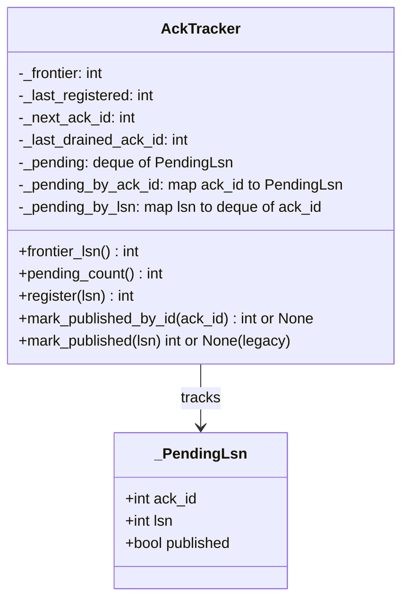
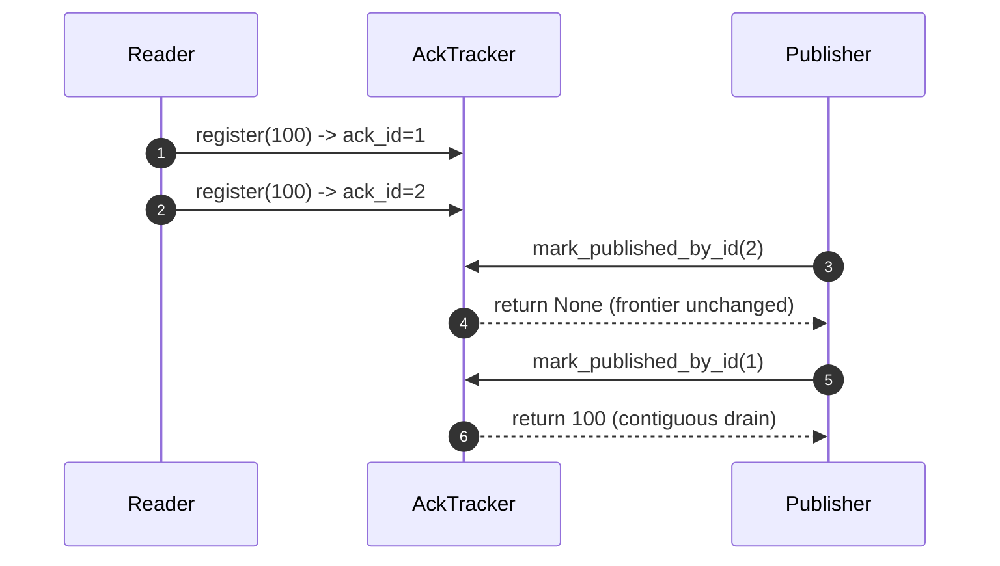

# AckTracker: Simple Line-by-Line Guide

## Purpose
This guide explains what `services/src/cdc_logical_replication/ack.py` does and why it now uses per-event `ack_id` matching.

Scope:
- This document covers `ack.py` only.
- The focus is reliable at-least-once progress tracking.

## Reliability Goal
- Primary goal: prevent data loss while advancing Postgres feedback safely.
- Delivery model: at-least-once.
- Not a goal: exactly-once delivery from the producer.
- Practical assumption: downstream readers are idempotent, so duplicates are acceptable.

Why this file exists:
- Kinesis results can arrive out of order.
- A single WAL transaction can emit multiple events with the same LSN.
- We must only advance frontier when the published prefix is contiguous in registration order.
- We must correlate publish success to the exact registered event, not just to an LSN value.

## Quick Glossary
- `_frontier`: highest contiguous safe LSN.
- `_last_registered`: highest registered LSN (enforces non-decreasing registration).
- `_next_ack_id`: monotonic counter for unique event identities.
- `_last_drained_ack_id`: highest ack_id fully drained from the head.
- `_pending`: global ordered queue of pending entries.
- `_pending_by_ack_id`: primary lookup index `ack_id -> pending node`.
- `_pending_by_lsn`: compatibility index `lsn -> deque[ack_id]` for legacy LSN-based API.
- `_PendingLsn`: one tracked pending entry (`ack_id`, `lsn`, `published`).

## High-Level Pipeline Context
```mermaid
flowchart LR
  PG[Postgres WAL / Logical Replication] --> READER[Replication Reader]
  READER --> REG[AckTracker.register(lsn) -> ack_id]
  READER --> Q[Inflight Queue]
  Q --> PUB[Kinesis Publisher]
  PUB --> MP[AckTracker.mark_published_by_id(ack_id)]
  MP --> FR[frontier_lsn advances when contiguous]
  FR --> FB[Standby feedback to Postgres]
```

Note:
- `mark_published(lsn)` still exists but is legacy/compat.
- Publisher correctness should use `mark_published_by_id`.

## Source File
- Path: `services/src/cdc_logical_replication/ack.py`
- Current line span: `1..105`

## Full Source (Reference)
```python
from __future__ import annotations

from collections import deque

from pydantic import BaseModel


class _PendingLsn(BaseModel):
    ack_id: int
    lsn: int
    published: bool = False


class AckTracker:
    """Tracks highest contiguous LSN confirmed published to Kinesis."""

    def __init__(self, *, initial_lsn: int = 0) -> None:
        self._frontier = initial_lsn
        self._last_registered = initial_lsn
        self._next_ack_id = 0
        self._last_drained_ack_id = 0
        self._pending: deque[_PendingLsn] = deque()
        self._pending_by_ack_id: dict[int, _PendingLsn] = {}
        self._pending_by_lsn: dict[int, deque[int]] = {}

    @property
    def frontier_lsn(self) -> int:
        return self._frontier

    @property
    def pending_count(self) -> int:
        return len(self._pending)

    def register(self, lsn: int) -> int:
        if lsn < self._last_registered:
            raise ValueError(
                f"LSN must be non-decreasing: got {lsn}, last registered {self._last_registered}"
            )

        self._next_ack_id += 1
        ack_id = self._next_ack_id
        self._last_registered = lsn
        pending = _PendingLsn(ack_id=ack_id, lsn=lsn)
        self._pending.append(pending)
        self._pending_by_ack_id[ack_id] = pending
        self._pending_by_lsn.setdefault(lsn, deque()).append(ack_id)
        return ack_id

    def mark_published(self, lsn: int) -> int | None:
        """Legacy LSN-based ack path; prefer mark_published_by_id."""
        bucket = self._pending_by_lsn.get(lsn)
        if not bucket:
            raise KeyError(f"Unknown or already-published LSN: {lsn}")

        pending: _PendingLsn | None = None
        for ack_id in bucket:
            candidate = self._pending_by_ack_id.get(ack_id)
            if candidate is not None and not candidate.published:
                pending = candidate
                break

        if pending is None:
            raise KeyError(f"Unknown or already-published LSN: {lsn}")

        pending.published = True
        return self._drain_contiguous_published()

    def mark_published_by_id(self, ack_id: int) -> int | None:
        pending = self._pending_by_ack_id.get(ack_id)
        if pending is None:
            if 0 < ack_id <= self._last_drained_ack_id:
                return None
            raise KeyError(f"Unknown ack id: {ack_id}")

        if pending.published:
            return None

        pending.published = True
        return self._drain_contiguous_published()

    def _drain_contiguous_published(self) -> int | None:
        advanced_to: int | None = None
        while self._pending and self._pending[0].published:
            pending = self._pending.popleft()
            self._last_drained_ack_id = pending.ack_id
            del self._pending_by_ack_id[pending.ack_id]

            bucket = self._pending_by_lsn[pending.lsn]
            if not bucket:
                raise RuntimeError(f"Invariant violation: empty LSN bucket for {pending.lsn}")
            bucket_head_ack_id = bucket.popleft()
            if bucket_head_ack_id != pending.ack_id:
                raise RuntimeError(
                    "Invariant violation: pending bucket order mismatch "
                    f"(lsn={pending.lsn}, expected_ack_id={pending.ack_id}, "
                    f"bucket_head_ack_id={bucket_head_ack_id})"
                )
            if not bucket:
                del self._pending_by_lsn[pending.lsn]

            if pending.lsn > self._frontier:
                self._frontier = pending.lsn
                advanced_to = self._frontier

        return advanced_to
```

## Data Structure View


## Why Ack-ID Is Needed For At-Least-Once
Problem case:
- Registered in order: `A(lsn=100)`, `B(lsn=100)`.
- Kinesis batch result is mixed: `A` fails retriable, `B` succeeds.

If acking is only by LSN, the success callback `100` is ambiguous.
It can accidentally mark `A` as published and let frontier progress incorrectly.

Using `ack_id`:
- Success for `B` marks only `B`'s ack_id.
- `A` remains pending.
- Frontier does not move past missing head entries.
- When `A` eventually succeeds (or is intentionally dropped by policy), frontier advances safely.

This is exactly what we want for at-least-once:
- no false progress (protects against data loss),
- duplicates still allowed and expected in failure/retry paths.

## Why This Is Required To Guarantee At-Least-Once
At-least-once depends on one invariant:
- never ACK Postgres past an event that has not actually been handled.

Crash/restart timeline with LSN-only acking:
1. Register order is `A(lsn=100)`, `B(lsn=100)`.
2. Kinesis returns partial success: `A` fails, `B` succeeds.
3. Publisher reports success using only `mark_published(100)`.
4. Tracker can attribute that success to the wrong event (`A`) because both share LSN `100`.
5. Frontier advances to `100`.
6. Process crashes before `A` is retried.
7. On restart, replication resumes from frontier `100`, so `A` may never be replayed.

That violates at-least-once, because one change can be lost.

With `ack_id`:
1. `B` success calls `mark_published_by_id(b_ack_id)` and marks only `B`.
2. `A` remains missing at the head of `_pending`.
3. Frontier does not advance until `A` is resolved.
4. After crash/restart, replay still includes unresolved work.

Result:
- no false frontier advancement,
- no silent drop of an unresolved change,
- reliable at-least-once semantics (with possible duplicates, which downstream idempotency handles).

## Block-by-Block Walkthrough

### Lines 1-5: Imports
- `annotations` for modern typing behavior.
- `deque` for fast queue operations.
- `BaseModel` for typed pending nodes.

### Lines 8-11: `_PendingLsn`
- `ack_id`: unique registration identity.
- `lsn`: WAL position.
- `published`: publish result state.

### Lines 14-24: Constructor State
- `_frontier` and `_last_registered` initialize WAL progress state.
- `_next_ack_id` allocates unique identities.
- `_last_drained_ack_id` tracks already-drained identities.
- `_pending` is the source-of-truth ordering queue.
- `_pending_by_ack_id` is the primary ack lookup map.
- `_pending_by_lsn` supports legacy LSN-based ack lookup and invariant checks.

### Lines 26-32: Read-Only Properties
- `frontier_lsn`: current safe contiguous frontier.
- `pending_count`: observability for inflight depth.

### Lines 34-47: `register(lsn) -> ack_id`
- Enforces non-decreasing LSN.
- Allocates a unique `ack_id`.
- Creates one `_PendingLsn`.
- Adds same node to:
  - ordered queue (`_pending`),
  - primary index (`_pending_by_ack_id`),
  - compat bucket (`_pending_by_lsn[lsn]` with `ack_id`).
- Returns `ack_id` to caller.

### Lines 49-66: `mark_published(lsn)` (Legacy)
- Compatibility path only.
- Resolves an unpublished node from the LSN bucket.
- Marks that node published.
- Delegates contiguous frontier movement to `_drain_contiguous_published()`.

Operational note:
- Publisher path should use `mark_published_by_id` to avoid LSN ambiguity.

### Lines 68-79: `mark_published_by_id(ack_id)` (Primary)
- Looks up exact pending node by `ack_id`.
- If not found:
  - returns `None` for already-drained ack ids (`0 < ack_id <= _last_drained_ack_id`),
  - raises `KeyError` for unknown future/invalid ids.
- If already marked published but not drained yet, returns `None`.
- Otherwise marks published and tries contiguous drain.

### Lines 81-105: `_drain_contiguous_published()`
- While queue head is published:
  - pop from `_pending`,
  - advance `_last_drained_ack_id`,
  - remove from `_pending_by_ack_id`,
  - enforce `_pending_by_lsn` head order invariant,
  - delete empty LSN bucket,
  - advance `_frontier` only if LSN increases.
- Returns the newest advanced frontier value or `None`.

## Common Scenarios

### 1) In-order success
- Register: `100, 200, 300` -> ack ids `1, 2, 3`.
- Publish by id: `1`, `2`, `3`.
- Frontier advances: `100 -> 200 -> 300`.

### 2) Out-of-order success
- Register: `100(1), 200(2), 300(3)`.
- Ack `2` first: marked published, frontier unchanged.
- Ack `1`: drain releases `1` and already-published `2`, frontier jumps to `200`.

### 3) Duplicate LSN mixed result (critical)
- Register: `100(1), 100(2)`.
- Ack `2` succeeds first, `1` fails retriable.
- Frontier remains unchanged because head `1` is missing.
- Retry succeeds for `1`, then drain advances frontier safely to `100`.

Sequence example:


## Failure Behavior
- `register` raises `ValueError` when LSN decreases.
- `mark_published_by_id` raises `KeyError` for unknown future/invalid `ack_id`.
- `mark_published_by_id` returns `None` for duplicate/late callback of already-drained `ack_id`.
- `mark_published` raises `KeyError` when LSN is unknown or fully consumed.
- `_drain_contiguous_published` raises `RuntimeError` on internal invariant mismatch.

## Complexity and Performance
- `register`: O(1).
- `mark_published_by_id`: O(1) lookup plus O(k) contiguous drain.
- `mark_published` (legacy): bucket scan worst-case O(m) for same-LSN entries, plus O(k) drain.

Why this is acceptable:
- Primary hot path is `ack_id` lookup.
- Correctness comes from draining only contiguous published head entries.

## Mental Model Recap
- `_pending` is truth for order.
- `_pending_by_ack_id` is truth for exact event correlation.
- `_pending_by_lsn` is mostly compatibility and invariant support.
- Frontier means: everything up to this LSN is safely processed under at-least-once semantics.
