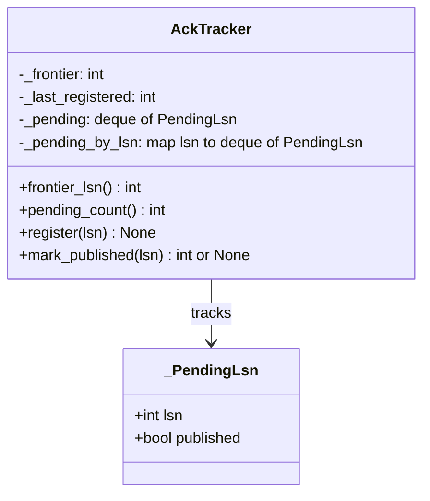
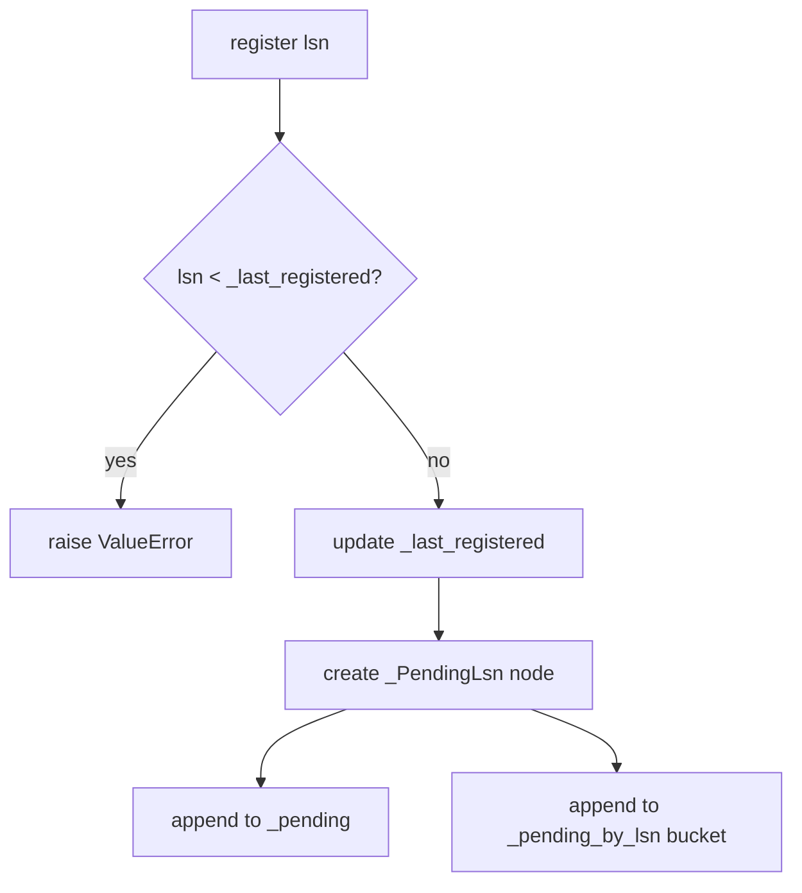
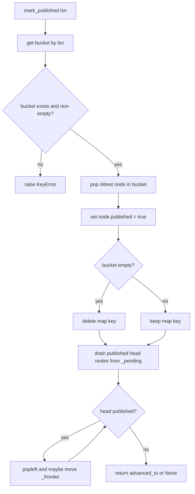
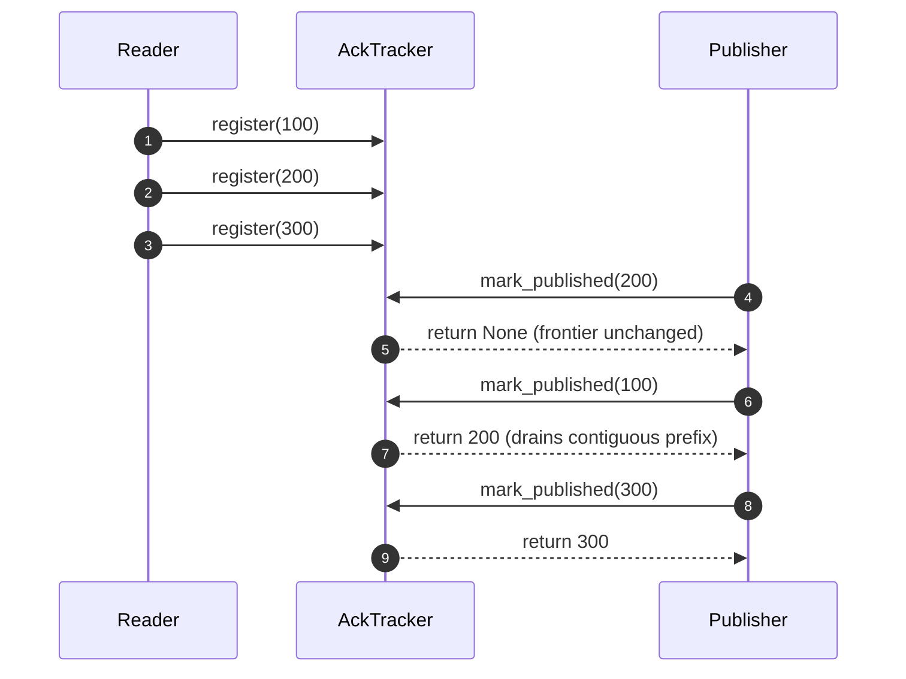

# AckTracker: Simple Line-by-Line Guide

## Purpose
This doc explains what each part of `services/src/cdc_logical_replication/ack.py` does in plain language.

Scope:
- We explain this file only.
- We group lines into small blocks so the guide stays easy to read.

## Context You Need First
- `CDC (Change Data Capture)`: reading database changes as they happen.
- `WAL (Write-Ahead Log)`: Postgres write log. Logical replication reads from here.
- `Logical replication`: stream of logical change events from Postgres.
- `LSN (Log Sequence Number)`: a numeric position in WAL. Higher LSN means later progress.
- `Inflight event`: an event that was read and sent for publishing, but not fully acknowledged yet.
- `Published`: Kinesis has accepted that event.
- `Contiguous published`: all earlier inflight LSN entries are also published, with no gap.
- `Frontier LSN`: highest WAL position we can safely report back to Postgres as processed.

Why this file exists:
- Kinesis publish results can arrive out of order.
- We can only advance Postgres ack progress when all older entries are done.
- `AckTracker` remembers pending entries and moves the frontier only when the published prefix is contiguous.

## Quick Glossary
- `_frontier`: current safe contiguous LSN.
- `_last_registered`: highest LSN ever registered (used for non-decreasing validation).
- `_pending`: ordered queue of all not-yet-drained entries.
- `_pending_by_lsn`: fast lookup index from `lsn -> deque of matching pending nodes`.
- `_PendingLsn`: one tracked entry (`lsn`, `published` flag).

## High-Level Pipeline Context
```mermaid
flowchart LR
  PG[Postgres WAL / Logical Replication] --> READER[Replication Reader]
  READER --> REG[AckTracker.register(lsn)]
  READER --> Q[Inflight Queue]
  Q --> PUB[Kinesis Publisher]
  PUB --> MP[AckTracker.mark_published(lsn)]
  MP --> FR[frontier_lsn advances when contiguous]
  FR --> FB[Standby feedback to Postgres]
```

## Source File
- Path: `services/src/cdc_logical_replication/ack.py`
- Current line span: `1..57`

## Full Source (Reference)
```python
from __future__ import annotations

from collections import deque

from pydantic import BaseModel


class _PendingLsn(BaseModel):
    lsn: int
    published: bool = False


class AckTracker:
    """Tracks highest contiguous LSN confirmed published to Kinesis."""

    def __init__(self, *, initial_lsn: int = 0) -> None:
        self._frontier = initial_lsn
        self._last_registered = initial_lsn
        self._pending: deque[_PendingLsn] = deque()
        self._pending_by_lsn: dict[int, deque[_PendingLsn]] = {}

    @property
    def frontier_lsn(self) -> int:
        return self._frontier

    @property
    def pending_count(self) -> int:
        return len(self._pending)

    def register(self, lsn: int) -> None:
        if lsn < self._last_registered:
            raise ValueError(
                f"LSN must be non-decreasing: got {lsn}, last registered {self._last_registered}"
            )

        self._last_registered = lsn
        pending = _PendingLsn(lsn=lsn)
        self._pending.append(pending)
        self._pending_by_lsn.setdefault(lsn, deque()).append(pending)

    def mark_published(self, lsn: int) -> int | None:
        bucket = self._pending_by_lsn.get(lsn)
        if not bucket:
            raise KeyError(f"Unknown or already-published LSN: {lsn}")
        pending = bucket.popleft()
        pending.published = True
        if not bucket:
            del self._pending_by_lsn[lsn]

        advanced_to: int | None = None
        while self._pending and self._pending[0].published:
            published_lsn = self._pending.popleft().lsn
            if published_lsn > self._frontier:
                self._frontier = published_lsn
                advanced_to = self._frontier

        return advanced_to
```

## Data Structure View


## Block-by-Block Walkthrough

### Lines 1-5: Imports
- `from __future__ import annotations` keeps type hints lightweight at runtime.
- `deque` gives fast append and pop from both ends.
- `BaseModel` (Pydantic) defines `_PendingLsn`.

Why it matters:
- This file needs queue behavior and a small typed record object.

### Lines 8-10: `_PendingLsn` model
- `lsn`: WAL position for this tracked entry.
- `published`: starts `False`; flips to `True` when publish success arrives.

Why it matters:
- Each inflight entry has a clear ack state.

### Lines 13-20: `AckTracker` class and constructor
- `_frontier` starts at `initial_lsn`.
- `_last_registered` tracks monotonic registration.
- `_pending` keeps entries in arrival order.
- `_pending_by_lsn` gives O(1)-average lookup by LSN.

Why it matters:
- We need both an ordered view (`_pending`) and an indexed view (`_pending_by_lsn`).
- Ordered view enforces contiguous frontier movement.
- Indexed view avoids linear scans on publish callbacks.

### Lines 22-24: `frontier_lsn` property
- Returns current safe frontier.

Why it matters:
- Other components use this value to report replication progress.

### Lines 26-28: `pending_count` property
- Returns number of entries still in `_pending`.

Why it matters:
- Useful visibility for tests and metrics.

### Lines 30-39: `register(lsn)`
- Validates non-decreasing order.
- If `lsn < _last_registered`, raises `ValueError`.
- Updates `_last_registered`.
- Creates one `_PendingLsn` object.
- Appends that same object to `_pending` (ordered queue).
- Appends that same object to `_pending_by_lsn[lsn]` (LSN bucket).

Why it matters:
- One node is referenced in both structures, so marking it published through the index is immediately visible in the ordered queue.

`register` flow:


### Lines 41-48: `mark_published(lsn)` lookup and mark
- Looks up `bucket = _pending_by_lsn.get(lsn)`.
- If bucket is missing/empty, raises `KeyError` (unknown or already fully published LSN).
- Pops oldest pending node from bucket (`popleft()`).
- Sets `pending.published = True`.
- Removes dict key when bucket becomes empty.

Why it matters:
- Publish callback matching is fast and stable, including duplicate LSN entries.

### Lines 50-55: Frontier advancement loop
- Starts with `advanced_to = None`.
- While head of `_pending` is published, pop it from `_pending`.
- If popped `lsn > _frontier`, move `_frontier` forward and update `advanced_to`.

Why it matters:
- Frontier only moves through a contiguous published prefix.
- Out-of-order success does not incorrectly skip gaps.

`mark_published` flow:


### Line 57: Return value
- Returns `int` when frontier advanced during this call.
- Returns `None` when this call did not advance contiguous frontier.

Why it matters:
- Caller can emit replication progress updates only when needed.

## Common Scenarios

### 1) In-order publish
- Register: `100, 200, 300`
- Publish: `100`, then `200`, then `300`
- Frontier moves on each call: `100 -> 200 -> 300`

### 2) Out-of-order publish
- Register: `100, 200, 300`
- Publish: `200` first
- `200` is marked published, but frontier stays at previous value because `100` is still missing.
- Publish `100` next: loop drains `100` then already-published `200`; frontier jumps forward.

### 3) Duplicate LSN entries
- Register: `100, 100, 200`
- First publish `100`: consumes first duplicate.
- Second publish `100`: consumes second duplicate.
- Buckets ensure duplicates are handled in registration order.

Out-of-order sequence example:


## Failure Behavior
- `ValueError` from `register` when new LSN is lower than previous registered LSN.
- `KeyError` from `mark_published` when LSN was never registered.
- `KeyError` from `mark_published` when all pending entries for that LSN were already consumed.

## Complexity and Performance
- `register`: O(1).
- `mark_published` lookup/mark: O(1) average via `_pending_by_lsn`.
- Frontier drain loop: O(k), where `k` is number of newly contiguous head entries.

Why this is good:
- Hot publish path avoids scanning all pending entries.
- Contiguity correctness is still enforced by `_pending` head-drain logic.

## Mental Model Recap
- Think of `_pending` as the truth for order.
- Think of `_pending_by_lsn` as a fast index to find which node to mark.
- `mark_published` only marks one node, then opportunistically drains any contiguous published prefix.
- Frontier means: "everything up to this LSN is safely done."
