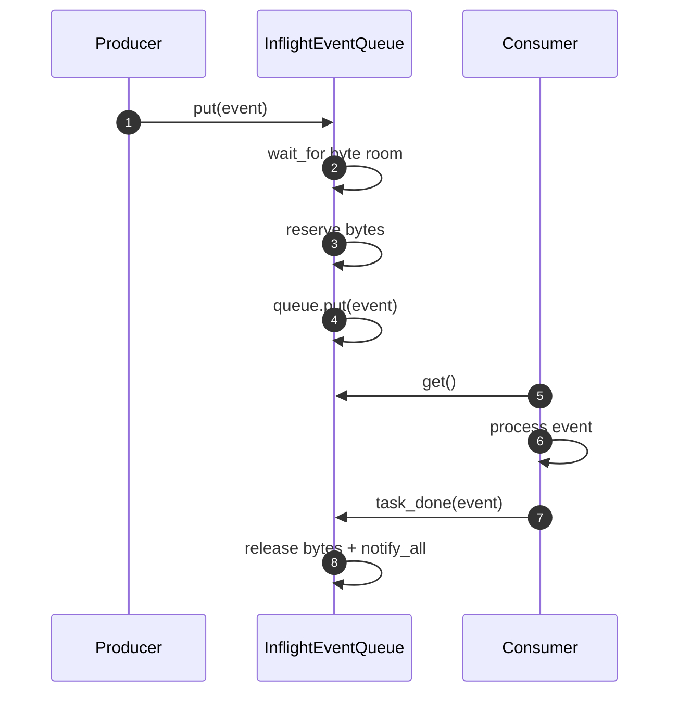
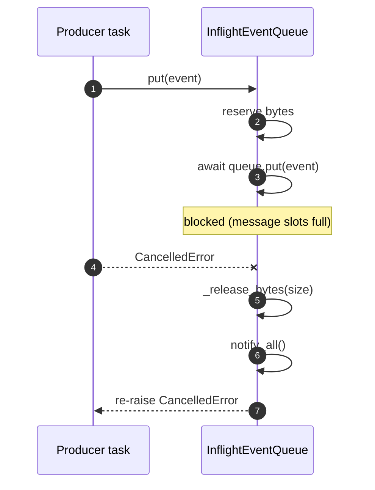
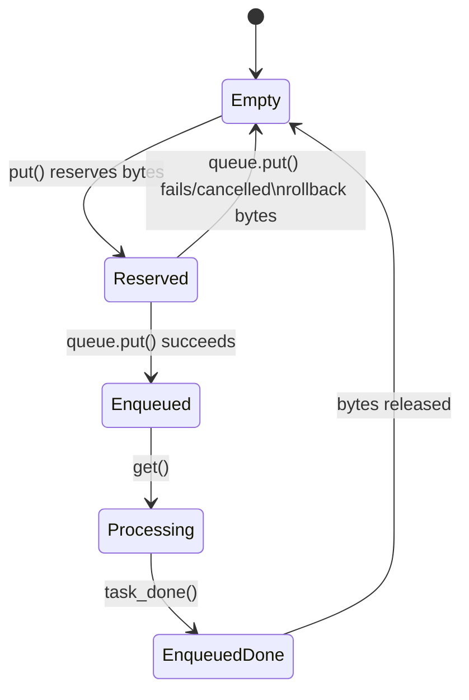

# CDC Inflight Queue: Simple Line-by-Line Guide

## Purpose
This doc explains what each part of `services/src/cdc_logical_replication/queue.py` does, in simple terms.

Scope:
- We explain this file only.
- We use grouped line ranges so the guide stays readable.

## Definitions (Key Concepts)
- `Producer`: the coroutine that creates a `ChangeEvent` and calls `put()`.
- `Consumer`: the coroutine that calls `get()`, processes the event, then calls `task_done()`.
- `Bounded queue`: the message-count limit from `asyncio.Queue(maxsize=max_messages)`.
- `Byte budget`: the memory limit from `_bytes_inflight <= _max_bytes`.
- `Byte reservation`: adding event size to `_bytes_inflight` before enqueue.
- `Byte release`: subtracting event size when work is done, or rolling back on failure.
- `Condition variable`: `_bytes_lock` (`asyncio.Condition`) used to wait for/release byte capacity.

Required flow summary:
- Producer -> `put()` -> bounded queue
- Consumer -> `get()` -> process -> `task_done()`
- Byte reservation/release and wake-ups via condition variable

## Quick Mental Model
```mermaid
flowchart LR
  P[Producer] --> PUT[put(event)]
  PUT --> Q[asyncio.Queue max_messages]
  Q --> GET[get()]
  GET --> PROC[Process event]
  PROC --> TD[task_done(event)]

  PUT -. reserve bytes .-> B[(bytes_inflight)]
  TD -. release bytes .-> B
  B -. notify waiters .-> PUT
```

## Source File
- Path: `services/src/cdc_logical_replication/queue.py`
- Current line span: `1..66`

## Block-by-Block Walkthrough

### Lines 1-5: Imports
- `from __future__ import annotations` enables postponed type evaluation.
- `import asyncio` gives `Queue` and `Condition`.
- `ChangeEvent` is the event type this queue stores.

Why it matters:
- The file uses async primitives and typed events.

### Lines 8-10: Class Declaration
- Defines `InflightEventQueue`.
- Docstring says the queue is bounded by both message count and bytes.

Why it matters:
- This is the core contract of the class.

### Lines 11-20: `__init__`
- Checks `max_messages > 0` and `max_bytes > 0`.
- Creates `_queue` as `asyncio.Queue(maxsize=max_messages)`.
- Stores byte limit in `_max_bytes`.
- Starts `_bytes_inflight` at `0`.
- Creates `_bytes_lock` as `asyncio.Condition()`.

Why it matters:
- Two independent limits are initialized: message slots and byte budget.

### Lines 22-31: Small Read Helpers
- `bytes_inflight` returns current reserved bytes.
- `max_bytes` returns configured byte limit.
- `qsize()` returns current queue length.

Why it matters:
- These methods expose safe read-only state for tests and monitoring.

### Lines 33-49: `put(event)`
- Reads event size: `size = event.record_size_bytes`.
- Rejects impossible events: if `size > _max_bytes`, raise `ValueError`.
- Enters `_bytes_lock` condition context.
- Waits until adding `size` would still fit: `_bytes_inflight + size <= _max_bytes`.
- Reserves bytes by incrementing `_bytes_inflight`.
- Tries to enqueue with `await _queue.put(event)`.
- If enqueue fails or task is cancelled, reacquires `_bytes_lock` and calls `_release_bytes(size)`.
- Re-raises the original exception after rollback.

Why it matters:
- Prevents byte-accounting leaks when enqueue fails after reservation.

```mermaid
flowchart TD
  A[put(event)] --> B{event too large?}
  B -- yes --> C[raise ValueError]
  B -- no --> D[wait for byte room]
  D --> E[reserve bytes]
  E --> F[await queue.put]
  F --> G[success]
  F --> H[exception or cancellation]
  H --> I[rollback reserved bytes]
  I --> J[re-raise]
```

### Lines 51-52: `get()`
- Waits for and returns the next queued `ChangeEvent`.
- No byte change happens here.

Why it matters:
- Dequeue and byte release are intentionally separated.

### Lines 54-57: `task_done(event)`
- Calls `_queue.task_done()` to mark queue work complete.
- Under `_bytes_lock`, releases this event's reserved bytes.

Why it matters:
- Byte budget is returned only when processing is completed.

### Lines 59-60: `join()`
- Waits until all queued items have matching `task_done()` calls.

Why it matters:
- Lets callers block until in-flight work drains.

### Lines 62-66: `_release_bytes(size)`
- Subtracts size from `_bytes_inflight`.
- Clamps to `0` if subtraction would go negative.
- Calls `notify_all()` on `_bytes_lock`.

Why it matters:
- Centralizes byte release logic and wakes blocked producers.

## End-to-End Success Path


## Cancellation / Failure Path in `put()`


## Two Limits, One Queue
Example:
- `max_messages = 2`
- `max_bytes = 15`
- Event sizes: `10`, `4`, `4`

What happens:
- First event (`10`) enters. Bytes now `10`.
- Second event (`4`) enters. Bytes now `14`.
- Third event (`4`) must wait, even if message slots were available, because `14 + 4 > 15`.

## State View


## Common Pitfalls
- Calling `get()` without eventually calling `task_done(event)` will keep bytes reserved.
- Confusing `qsize()` with byte usage; message count and bytes are separate limits.
- Assuming cancellation during `put()` is harmless; rollback exists to prevent leaked byte reservations.

## Cheat Sheet
- Use `put(event)` to reserve bytes and enqueue.
- Use `get()` to pull the next event.
- After processing, always call `task_done(event)`.
- `join()` waits for all queued tasks to be marked done.
- `_bytes_lock` controls waiting for byte capacity.
- `_release_bytes()` always notifies waiting producers.
- Invariant: `_bytes_inflight` is clamped to never go below `0`.
