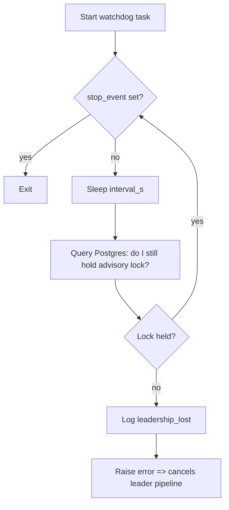
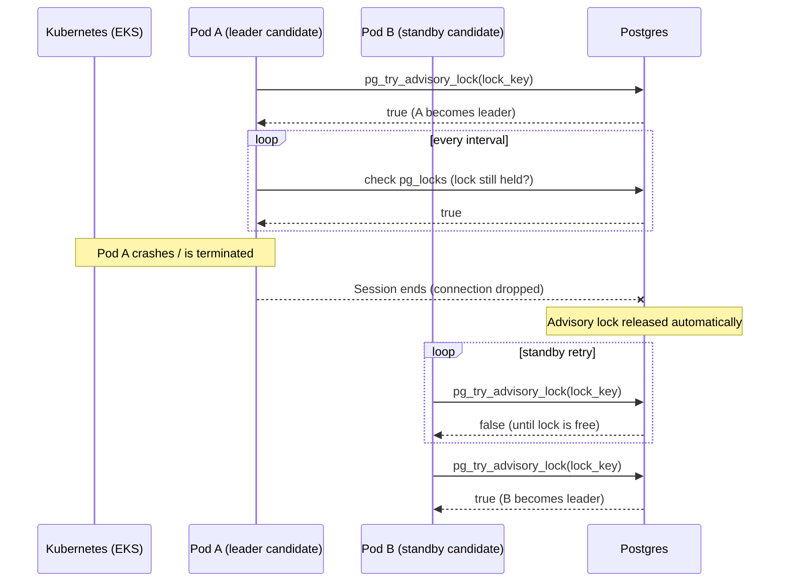
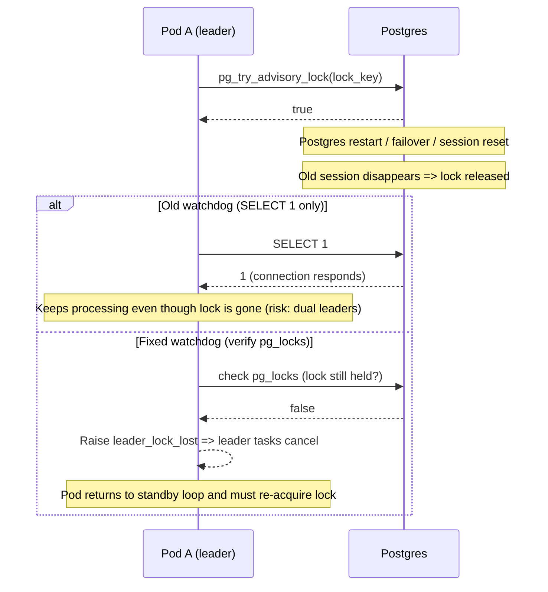

# CDC Leadership Watchdog (Advisory Lock Safety)

This document explains, in simple terms, what the CDC service "leadership watchdog" does and why it must verify advisory lock ownership (not just connection liveness).

## 1) Key Concepts

- **Pod (EKS):** A running instance of your service (usually several replicas).
- **Leader / Standby:** All pods run, but only the pod holding the lock is allowed to do "leader work" (read replication + publish).
- **Postgres advisory lock:** A lightweight mutex stored in Postgres. It is **owned by a Postgres session**.
- **Postgres session / connection:** The TCP connection + backend process state. If the session ends or is reset, the advisory lock is released.
- **Watchdog:** A background task that periodically verifies "I'm still the leader". If not, it forces the leader pipeline to stop.

## What The Watchdog Does (Simple Loop)

## 2) Real-Life EKS Production Scenarios

### Scenario A: Leader Pod Crashes/Terminates, Standby Takes Over

### Scenario B: Postgres Restart/Session Reset (The "Silent Lock Loss" Case)

This is the failure mode the watchdog is designed to catch: the process can still talk to Postgres, but the *original session that held the lock* is gone, so the lock is gone too.

› So in the case where postgres restarts. What exactly happens with the leader pod?

• In our app, when there's an exception from the watchdog, tasks get canceled. The app catches this in the run() function, closes the leader session, and then returns to waiting for leadership without exiting the pod. So, the leader pod likely remains up but pauses its work until it can reacquire the lock.
  Also, the replication reader uses a separate connection in consume_replication_stream to perhaps manage reconnects, but the pipeline gets canceled anyway. I'll keep it clear.

• When Postgres restarts (or you hit an RDS failover), the “leader pod” doesn’t automatically lose leadership in Kubernetes terms. What happens is at the database session level.

  There are two common behaviors, depending on how the connection break manifests:

  1) Connection breaks hard (most common)

  - Postgres restarts, the TCP connection behind the leader’s lock session is dropped.
  - The Postgres backend session disappears, so the advisory lock is released immediately.

  2) Connection “recovers” but session is new (the dangerous case)

  - Some setups can make the app believe the DB is reachable again quickly (new session after reconnect, or a proxy-layer behavior).
  - The service can successfully run a simple query (like SELECT 1) even though it is now a different DB session.
  - Advisory locks do not survive that: the old session died, so the lock is gone.
  - With the fixed watchdog, the next check verifies via pg_locks whether this session still holds the lock; it returns false and the pod stops leader work immediately and re-enters standby/re-election.

  Net: the leader pod usually stays running, but it should stop doing “leader” work and only resume after it successfully re-acquires the advisory lock.

› So the app wont error out, the running pod will attempt to become the leader and establish a lock?

• It depends on what you mean by “the app”:

  - The pod/process generally keeps running. It does not crash the container on lock loss.
  - The leader cycle does error out. The watchdog raises (leader_lock_lost or a connection exception), which cancels the leader tasks; run() catches that, logs leader_cycle_failed, closes the leader session, sleeps, then calls wait_for_leadership(...) again to try to become leader.

  So after a Postgres restart, the same running pod will typically drop out of leader mode and then start attempting to re-acquire the advisory lock in the standby loop. If another replica wins the lock first, this pod stays standby and keeps retrying.
