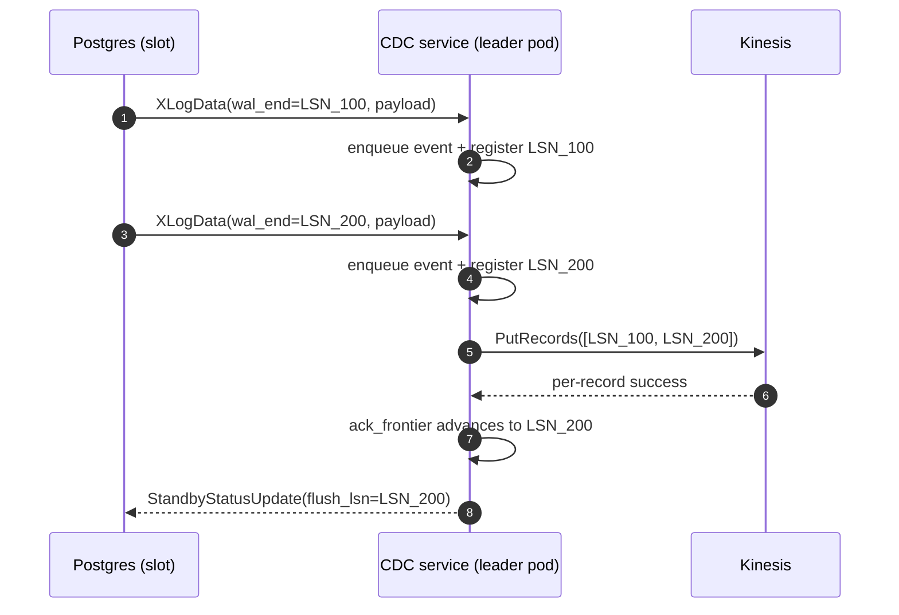
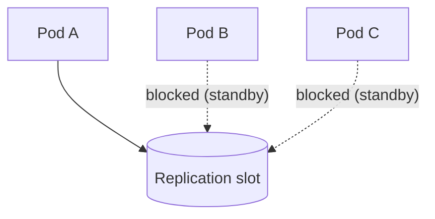
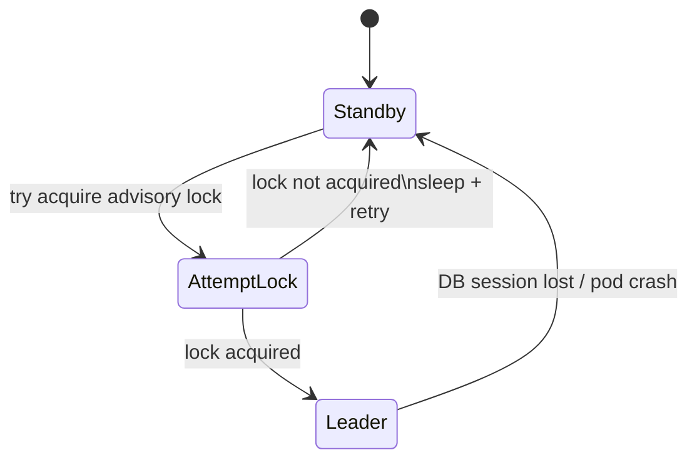

# Postgres CDC to Kinesis (Logical Replication) - Visual Overview

## TL;DR
- Postgres emits changes into its write-ahead log (WAL).
- A single leader pod reads those changes from a logical replication slot (wal2json).
- The pod batches events for a few milliseconds and writes them to Kinesis with `PutRecords`.
- Only after Kinesis confirms success do we ACK/flush the corresponding LSN back to Postgres.

This is a low-latency, production-safe version of the common "consume logical replication and forward to Kinesis" pattern.

Related (more technical) plan: `docs/plans/codex/kinesis-cdc-streaming.md`.

## Big Picture
```mermaid
flowchart LR
  subgraph RDS[Amazon RDS for PostgreSQL (Multi-AZ cluster endpoint)]
    SLOT[(Logical replication slot)]
    LOCK[(Advisory lock\n(slot-derived key))]
  end

  subgraph EKS[AWS EKS deployment (replicas >= 2)]
    subgraph LEADER[Leader pod (exactly 1)]
      READER[Replication reader\n(psycopg COPY BOTH)]
      Q[Bounded inflight queue\n(messages + bytes)]
      BATCH[Micro-batcher\n(max delay e.g. 10ms)]
      PUT[Publish to Kinesis\n(PutRecords)]
      ACK[Ack frontier tracker\n(contiguous LSN)]
    end
    subgraph STANDBY[Standby pod(s)]
      WAIT[Retry loop:\ntry acquire advisory lock]
    end
  end

  KDS[(Kinesis Data Stream)]
  CONSUMERS[Downstream consumers\n(scale here)]

  STANDBY -. try pg_try_advisory_lock .-> LOCK
  LEADER -. holds lock for lifetime .-> LOCK

  SLOT -->|XLogData frames| READER
  READER --> Q
  Q --> BATCH
  BATCH -->|batched records| PUT
  PUT -->|success per record| ACK
  ACK -->|StandbyStatusUpdate (ACK/flush)| SLOT

  PUT --> KDS
  KDS --> CONSUMERS
```

## What Happens for Each Change (and Why ACK Matters)
Postgres includes every change in WAL. The replication slot tracks "how far the consumer has safely processed".

The key rule:
- We only advance the slot (ACK/flush LSN) after Kinesis confirms the write succeeded.



### "Ack frontier" in one picture
The frontier is the highest contiguous LSN where every earlier event is confirmed written to Kinesis:

```
LSNs seen:     100   200   300   400
Kinesis ok?:    Y     Y     N     Y
ACK frontier:  200  (stops at the first gap)
```

This prevents data loss:
- If the pod crashes after publishing LSN_400 but before ACKing LSN_300, Postgres can resend from the last flushed LSN.
- Duplicates are possible (at-least-once); downstream should be idempotent if needed.

## One Slot, One Consumer (How Scaling Works)
Postgres allows only one active consumer per replication slot.



To scale, you write once to Kinesis and scale downstream consumers:
- 1 producer (this service) per slot
- N consumers reading from Kinesis

If you ever need multiple independent producers, you create multiple slots (and run one service instance per slot).

## High Availability (Active/Standby)
All pods try to acquire the same Postgres advisory lock (derived from the slot name). Exactly one pod becomes leader.



Why this works:
- Advisory locks are held by the DB session. If the leader dies, the lock is released automatically.

## Low Latency Without Unbounded Memory
We bound latency with micro-batching and bound memory with backpressure.

```mermaid
flowchart LR
  READER[Reader] --> Q[Bounded queue\n(max messages + max bytes)]
  Q --> BATCH[Batch up to:\n- max records\n- max bytes\n- max delay (ms)]
  BATCH --> PUT[PutRecords]
  PUT -->|slow / throttled| RETRY[Retry failed records\n(no ACK)]

  Q -. queue fills .-> READER
  READER -. blocks on put .-> Q
```

If Kinesis slows down:
- the publisher retries failed records indefinitely
- the queue fills
- the reader blocks (natural backpressure)
- ACK frontier stops advancing (Postgres retains WAL until the outage clears)

## Failure Modes (What You Should Expect)
| Failure | What happens | Why data stays safe | What to watch |
|---|---|---|---|
| RDS writer failover | replication connection drops | reconnect; slot resumes from last flushed LSN | replication lag, reconnect loops |
| Kinesis throttling / partial failures | some `PutRecords` entries fail | retry failed entries; do not ACK past gaps | retry rate, queue fill, lag |
| Leader pod crash | standby becomes leader | lock released; new leader resumes from flushed LSN | leader transitions |
| Prolonged Kinesis outage | retries continue; ACK pinned | WAL retained grows by design | WAL retained bytes, slot lag |

## Config at a Glance (Env Vars)
Postgres:
- `PGHOST`, `PGPORT`, `PGUSER`, `PGPASSWORD`, `PGDATABASE`
- `REPLICATION_SLOT` (default `etl_slot_wal2json`)

wal2json:
- `WAL2JSON_FORMAT_VERSION` (default `2`)
- `WAL2JSON_INCLUDE_TIMESTAMP` (default `true`)
- `WAL2JSON_INCLUDE_LSN` (default `true`)
- `WAL2JSON_INCLUDE_TRANSACTIONS` (default `false`)
- `WAL2JSON_INCLUDE_PK` (default `true`)

Kinesis:
- `AWS_REGION`, `KINESIS_STREAM`
- batching: `KINESIS_BATCH_MAX_RECORDS`, `KINESIS_BATCH_MAX_BYTES`, `KINESIS_BATCH_MAX_DELAY_MS`

HA + backpressure:
- `LEADER_LOCK_KEY_OVERRIDE` (optional)
- `STANDBY_RETRY_INTERVAL_S`
- `INFLIGHT_MAX_MESSAGES`, `INFLIGHT_MAX_BYTES`

## Glossary
- WAL: Postgres write-ahead log (source of truth for changes).
- Replication slot: Postgres mechanism that retains WAL until the consumer confirms progress.
- LSN: log sequence number; a cursor into WAL used to track progress.
- ACK/flush: sending feedback so Postgres can advance the slot and recycle old WAL.
